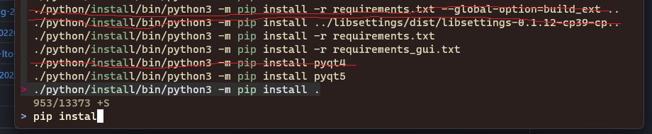
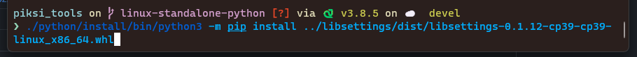
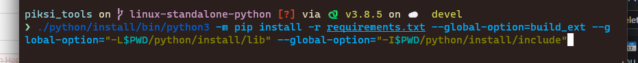

# Build notes

This was build using Python standalone installer from here: <https://github.com/swift-nav/python-build-standalone/releases/tag/20220205%2Bswift>

A few custom `pip install` commands where needed:



In addition:



Finally:



---

The following launch script was used:

```
#!/bin/bash
"$(dirname "$0")"/bin/python3 -m piksi_tools.console $*
```
